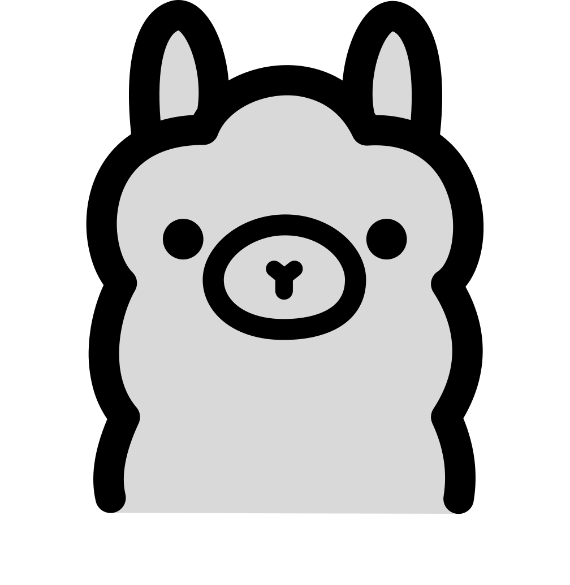
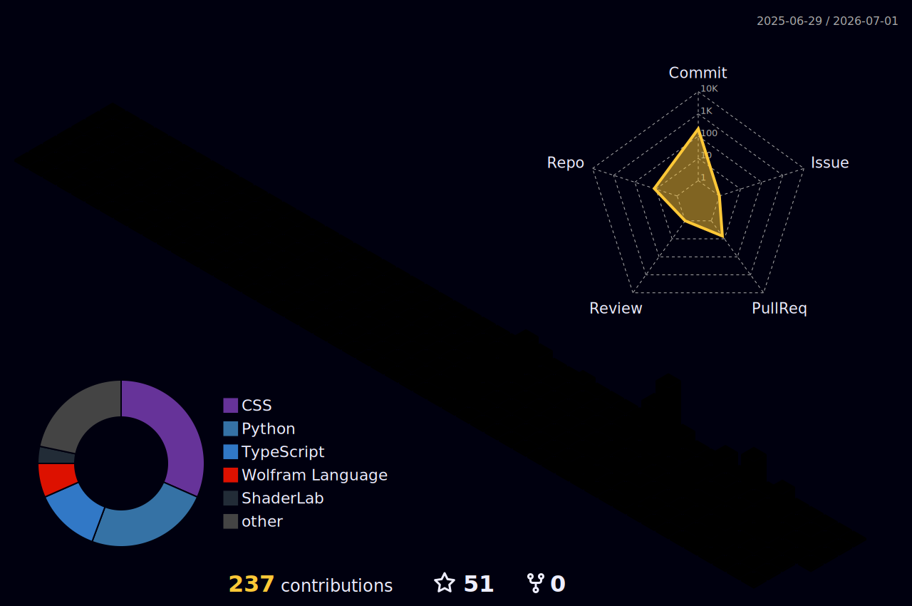

    

    

### `Hello World!!`  I am a passionate software developer who wants to learn new things every day.

- 🔭 I’m currently working on [CleverWick](https://github.com/sanath-kumar-s/CleverWick)
- 🌱 I’m currently learning **React, TypeScript**
- 🔭 I’m currently working on [Python-beginner-Projects](https://github.com/sanath-kumar-s/Python-beginner-projects)
- 📫 How to reach me **sanathkumar5638@gmail.com**

 

  

<h2 align="left">
   Connect with me:</h2>

  
  

 

<h2 align="left">
   
  Languages
</h2>

 

 

<h2>
  
   My Toolbox
</h2>

 

<h2 align="left">
   
  AI Toolbox
</h2>

 
 
 
 
 

 

##  Who am I?

  

 

##  My stats

 

#  Passionate developer building cool stuff

